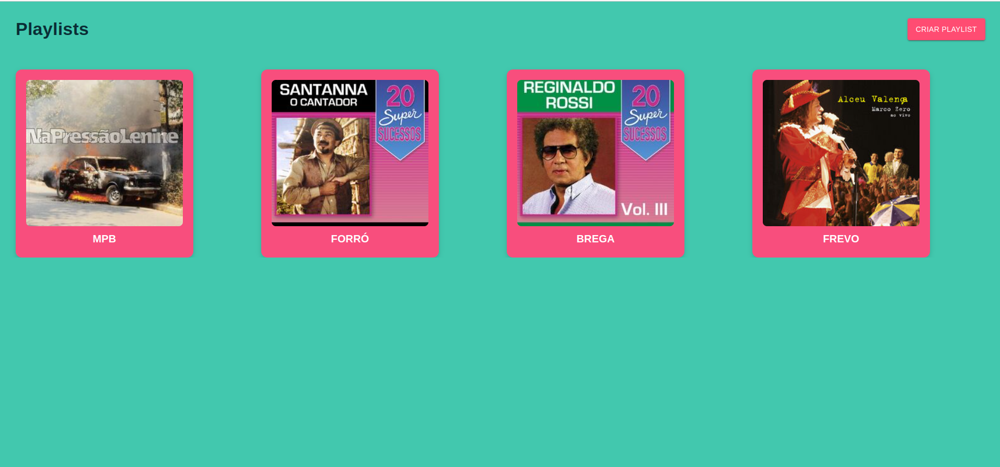
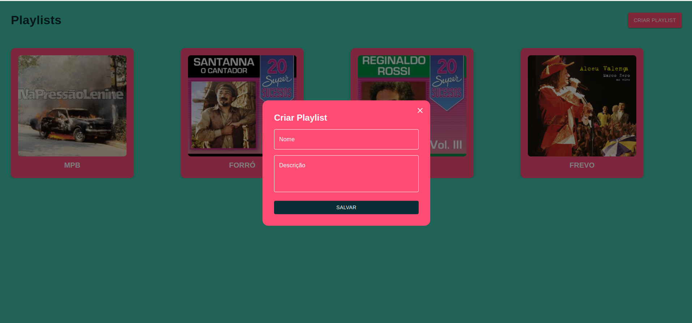
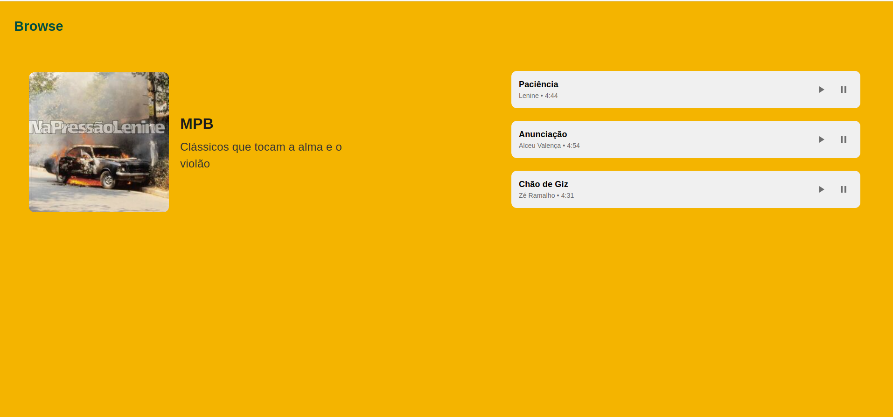
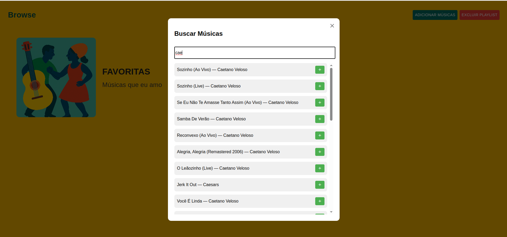
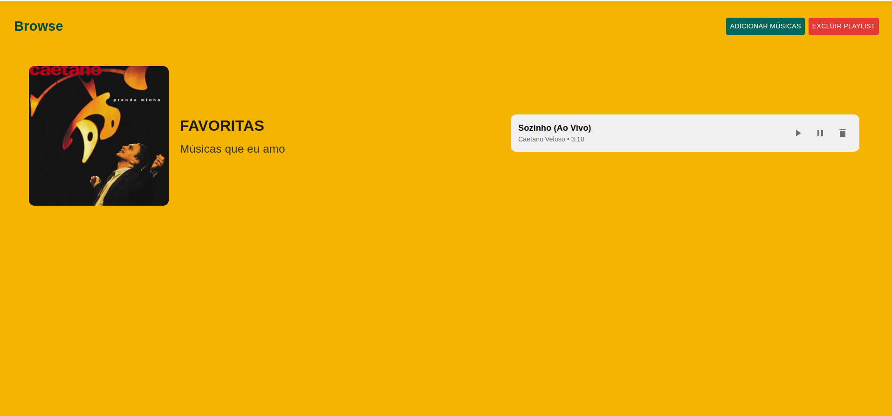

# 🎶 Projeto de Plataforma musical

Este é um aplicativo fullstack de gerenciamento de playlists musicais. Ele permite que os usuários explorem, criem, editem e excluam playlists personalizadas, bem como adicionem ou removam faixas individuais. A interface é moderna, colorida e responsiva, com uma experiência voltada para a simplicidade e usabilidade.

## APIs Utilizadas

- 🎵 **Deezer API** — Utilizada para buscar informações sobre músicas, capas de álbuns e prévias de áudio utilizadas nas playlists.

## 🔧 Tecnologias Utilizadas

- **Frontend**: React + Vite, com Emotion e MUI v5 para estilização
- **Backend**: Node.js + Express, utilizando Knex.js para ORM
- **Banco de Dados**: MySQL
- **Docker**: Containers para o ambiente de desenvolvimento e banco
- **Testes**: Jest no frontend e backend
- **ESModules**: Projeto totalmente em ESModules (`type: "module"` no `package.json`)

## 💡 Funcionalidades

- Visualização de playlists com capas dinâmicas
- Reprodução e pausa de músicas com integração à API de busca musical
- Criação e exclusão de playlists com confirmação por modal
- Adição e remoção de músicas individuais
- Redirecionamentos automáticos após ações (ex: exclusão de playlist)

## Pré-requisitos

- [Docker](https://docs.docker.com/get-docker/) instalado
- [Docker Compose](https://docs.docker.com/compose/install/) instalado

---

## Configuração das variáveis de ambiente

### 1. Crie o arquivo `.env` na raiz do projeto (mesmo nível do `docker-compose.yml`):

```env
DB_HOST=db
DB_USER=root
DB_PASSWORD=root
DB_NAME=musicdb
FRONTEND_PORT=3000
BACKEND_PORT=5000
```

### 2. Crie o arquivo `.env` dentro da pasta `backend/` com o mesmo conteúdo:

```env
DB_HOST=db
DB_USER=root
DB_PASSWORD=root
DB_NAME=musicdb
FRONTEND_PORT=3000
BACKEND_PORT=5000
```

### 3. Crie o arquivo `.env` dentro da pasta `frontend/` com o mesmo conteúdo:

```env
VITE_BACKEND_PORT=5000
VITE_FRONTEND_PORT=3000
VITE_BACKEND_URL=http://localhost:${VITE_BACKEND_PORT}
```

---

## Rodando o projeto

### 1. Construir e subir os containers

```bash
docker-compose up --build
```

### 2. Rodar as migrations (criar tabelas no banco)

```bash
docker-compose exec backend npm run migrate
```

### 3. Rodar os seeds (inserir dados mock)

```bash
docker-compose exec backend npm run seed
```

Obs: Dependendo da versão do docker, os comandos devem ser rodados sem o -
Exemplo: docker compose up --build

---

## Como acessar a aplicação

- Backend API estará disponível em: `http://localhost:${BACKEND_PORT}`
- Frontend React estará disponível em: `http://localhost:${FRONTEND_PORT}`
- Login:

```bash
Email: user@test
Senha: 3nds83whr0sdofk
```

---

## Como rodar testes

- Frontend: docker-compose --profile test up frontend-test
- Backend: docker-compose run --rm backend npm run test

---

## Documentação endpoints

- Postman: https://documenter.getpostman.com/view/21552877/2sB2qZG3Uy#cf2df9ea-41b5-4a04-9cc4-d5a9b50c693b

---

## Comandos úteis

### Logs

- Backend logs:

```bash
docker-compose logs -f backend
```

- Frontend logs:

```bash
docker-compose logs -f frontend
```

### Acessar container backend

```bash
docker-compose exec backend sh
```

### Parar containers

```bash
docker-compose down -v
```

### Remover dados e tabelas do banco

```bash
docker-compose exec backend npm run migrate:rollbak
```

---

## Observações

- O banco MySQL fica exposto na porta `3306`, com senha `root` e database `musicdb`.
- O backend se conecta ao banco via hostname `db` (nome do serviço no docker-compose).
- As migrations e seeds usam `knexfile.mjs` que lê as variáveis via `dotenv`.
- Os volumes Docker garantem persistência dos dados do MySQL (`mysql_data`).

---

## Features futuras

- Cadastro de usuários
- Verificações de segurança para acesso das páginas

---

Para dúvidas e sugestões, entre em contado através do email: ilenaaciolids@gmail.com

## Imagens






